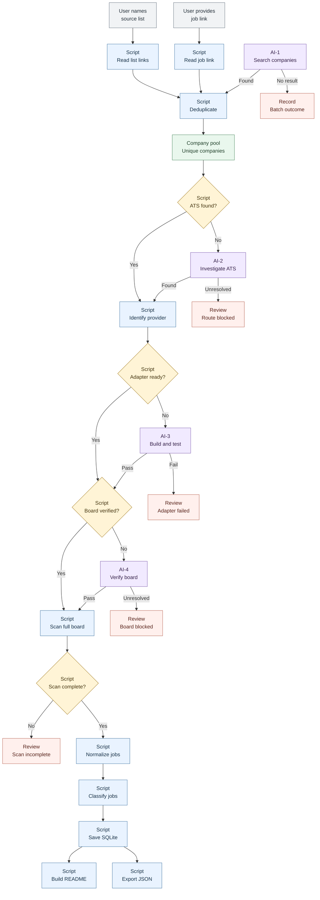

# Search Job architecture and rules

This document describes the **current target workflow and public classification rules**. It changes when the design changes. It does not imply that every step is running today: [STAGE.md](STAGE.md) tracks verified implementation, while [README.md](README.md) shows how to use what exists now. The repository root [README](../README.md) is the generated, reader-facing job list.

## End-to-end flow

The three entrances are a user-provided job or careers link, a user-named source list such as Simplify, and a requested AI search for new companies. Each yields a company name with any useful careers/Application link and its source. The script deduplicates those candidates into the **company pool**: one saved company list with links and source evidence. A place in the pool does not mean its ATS or board is verified. This pool and the intake scripts are part of the target workflow; [STAGE.md](STAGE.md) records when they become runnable.

Read the diagram from top to bottom. Gray boxes are user inputs, blue boxes are **Script**, purple boxes are bounded **AI tasks**, green is the company pool, yellow diamonds are checks, and red boxes record batch outcomes or blockers. A successful branch rejoins the script path; a failed or unresolved branch records its exact outcome. The four possible AI tasks have different missions:

| AI task | Trigger and input | Successful result | If unresolved |
| --- | --- | --- | --- |
| **AI-1 Company discovery** | A user requests a bounded search for new companies; existing companies and named lists are handled by scripts first. | Sourced company leads with useful careers/Application links. | Keep the discovery batch position and concrete failure. |
| **AI-2 ATS investigation** | The official company careers route does not reveal a clear ATS host/path after script extraction and one bounded search. | Evidence-backed company-to-ATS provider route. | Record the unresolved route and evidence. |
| **AI-3 Adapter development** | The ATS provider is confirmed, but no tested collector can read it. | One reusable adapter with fixtures and a bounded official-board test. | Mark `adapter_failed` only after the attempt; retain details. |
| **AI-4 Board verification** | Provider and adapter are known, but the company-to-board URL/token or brand association remains uncertain or unreadable after script checks. | Verified company-to-board mapping and a readable board. | Record the exact board/association failure for review. |

An **AI task** is a bounded Codex run that researches, changes code when necessary, and verifies its result. These are conditional handoffs, not four mandatory calls for every company. A queued work item is not completed AI work. Routine board scans and per-job classification do not use AI reasoning. No application preparation or submission occurs here.

The project skills follow this boundary: [`search-job-run`](../.agents/skills/search-job-run/SKILL.md) coordinates an authorized run; [`company-discovery`](../.agents/skills/company-discovery/SKILL.md), [`ats-routing`](../.agents/skills/ats-routing/SKILL.md), [`ats-adapter`](../.agents/skills/ats-adapter/SKILL.md), and [`board-verification`](../.agents/skills/board-verification/SKILL.md) cover AI-1 through AI-4 respectively. [`job-search`](../.agents/skills/job-search/SKILL.md) guides verified-board scans and publication. [STAGE.md](STAGE.md) states which underlying scripts are available now.

## 1. Find company leads

Three entrances produce the same compact lead: company name or domain, a useful careers/application URL when available, its source, and the evidence needed to revisit it.

1. **Bounded AI discovery:** find company candidates when requested; it does not run silently inside a script schedule.
2. **User-supplied link:** accept a company careers page or a specific job/application link.
3. **Named third-party list:** parse a user-selected source such as Simplify, especially its Application links.

**Script:** normalize company names/domains and URLs, merge duplicate leads, and retain their source. An external Apply URL is a clue, not proof that a company owns the board. Already verified companies and boards are reused; an unchanged route does not need a fresh ATS search on every scan.

## 2. Establish the official ATS route

**Script:** visit the company's official careers page, extract its official job/application links, and recognize the ATS host or path. If the official route cannot be found or parsed, use one bounded `company + careers` web search and confirm the result against the official company domain. Record the company-to-provider evidence and last check. **AI:** investigate only unresolved cases. A company site with embedded jobs, a custom careers page, or an unrecognized provider stays pending until evidence is sufficient; it is not marked as a working ATS route merely because a third-party list has a link.

## 3. Resolve provider, adapter and board

A **provider capability registry** maps each supported ATS type and host to one reusable adapter. Company-specific board routes are separate data: `company_boards → boards → provider capability`. One company may have several boards; one board may serve several brands, so company attribution needs evidence and a shared board should be scanned once.

**Script:** select the existing adapter from the provider type, find the board URL/token in official links, verify that this company's jobs belong to that board, and check that the adapter can read it. Previously verified routes can be imported as **pending recheck** seeds; official association and readability must pass before activation. **AI-3:** if the provider has no adapter, research its public listing method, implement a reusable adapter, run fixtures and a bounded official-source test. **AI-4:** when the provider/adapter is ready but the company-to-board association or readability remains unresolved, investigate the official board evidence. Only after a concrete retry fails does the workflow record the exact adapter/board failure for review and downstream dashboard reporting. Nine adapters developed in the private experiment are extraction inputs, not reasons to reimplement them.

## 4. Scan boards and identify openings

**Script:** traverse the full board, including pagination; prefer the listing response's posting ID, title, location, official Apply URL and source dates. Reuse a description already present in that response. Fetch and cache a separate detail only when a title is ambiguous or optional evidence needs it. Record incomplete/failed scans distinctly from complete scans.

A posting's primary identity is **provider + board + ATS posting ID**. A canonical official Apply URL is supporting or fallback evidence. Different IDs remain different openings even with the same title; one ID with multiple locations or Apply links remains one logical opening with multiple variants. Without an ID, a canonical URL and source evidence are required; title alone is insufficient.

Keep raw date field/value, precision, first and last observation, and any reliable publication and update timestamps separately. The earliest reliable **publication** time survives same-posting updates. If publication time is absent, use stable first discovery for Age and mark it `🔎`; an update-only field is not publication evidence. Reopening the same ID needs explicit official evidence or review. Only an official closed signal or repeated absence from **complete, successful** scans can mark a posting inactive; a failed or partial scan cannot close it.

## 5. Assign public categories and optional evidence tags

This is public **classification**, not a person's include/exclude filter. The opening stays in SQLite even when it does not enter the preferred SDE table. Title rules run first, case-insensitively, and save the rule version and reason. Categories may overlap when both rules genuinely match. A description already returned by the listing API may help with an ambiguous title; otherwise leave it `Other and unclassified` until evidence improves. There is no per-posting AI judgment.

| Public table | Title rule for the first version |
| --- | --- |
| Software Engineering — Senior and unspecified | Software/developer/programmer, backend/full-stack, cloud/platform/infrastructure engineering, SRE/DevOps, data/ML/AI engineering; exclude explicit Junior/New Grad/Intern and Staff/Principal from this **preferred** table. Explicit Senior and unspecified levels both qualify. |
| Software Engineering — Junior and New Grad | Same broad engineering family with explicit Junior, New Grad, Entry Level, Graduate or Intern wording. |
| Software Engineering — Staff and Principal | Same broad engineering family with explicit Staff, Principal or Distinguished wording. |
| Product Manager | Title contains **both** `product` and `manager`, in either order and any capitalization. The current word-based rule also catches related titles such as `Product Design Manager`; contributors can propose a narrower rule with examples. |
| Engineering Manager | Title contains **both** `engineer`/`engineering` and `manager`, in either order and any capitalization. `Manager, Software Engineering` qualifies. |
| Frontend / Mobile / QA and Test | Specialist title wording takes precedence over the broad SDE view. Mobile needs an engineering/developer/programmer role as well as the mobile platform term. |
| Analyst | `Analyst` or `Analysts`, including Business, Finance and Business Intelligence variants. |
| Scientist and Researcher | `Scientist` or `Researcher` wording. |
| Other and unclassified | No category rule has enough title evidence; retain the opening for later rule review. |

The exact executable patterns live in [`core.py`](src/search_job/core.py); this table states their intended behavior so a proposed rule change can be discussed and tested. If a title has both manager pairs, it can appear in both manager tables and still has one stable opening identity.

Optional work authorization, sponsorship, citizenship, green-card, OPT/H-1B or clearance badges require explicit source evidence. An absent badge means **unknown** and never excludes a public opening. Required experience years may be stored if already available, but do not trigger mandatory detail requests or appear as a first-version README column. Personal preference filtering belongs to a downstream private consumer, not Search Job's public categories.

## 6. Publish the result

Search Job's **local SQLite is the source of truth**. Rendering queries it at a chosen as-of time and builds the root README deterministically. The page starts with a short reader-facing explanation, category links/counts, then category tables with **Company** (official site), **Role**, **Location**, **Application** (`Apply` linked to the official URL), and **Age**. Each category sorts newer roles first; inactive roles stay in a collapsed section. Age remains in days (`0d`, `1d`, `90d`): `🔎` marks first discovery rather than ATS publication, and `†` marks date-only source precision. For a precise timestamp, `0d` means less than 24 hours; a date-only source does not claim hour precision.

The same DB produces a **versioned JSON export** with stable opening keys, variants, tags, date provenance and open state; a future handoff also exposes unresolved route/adapter/board failures. A downstream personal application tool may apply its own filter and import it idempotently, then show failures in its private Dashboard; Search Job does not read or modify that consumer's private database. Generated README rows are changed by updating rules/data and rerendering, not by hand-editing output. Private SQLite, credentials and run logs never enter Git. Development changes are reviewed and pushed to `origin/dev`; `main` changes only on explicit merge instruction. A local scheduled refresh is a later stage; GitHub Actions and unattended AI work are not assumed.

## Contributing to the rules

A useful proposal names example titles that should match, example titles that should not, the intended category or badge, and whether the change should affect existing saved postings. Add focused fixtures for the new boundary before regenerating the README. [STAGE.md](STAGE.md) identifies which parts of this target flow have been verified so far.
